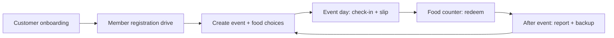
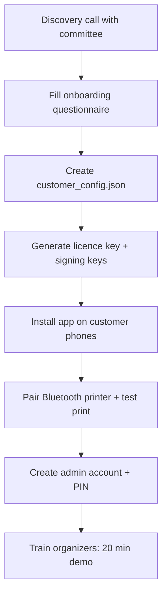
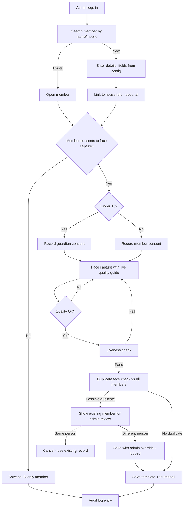
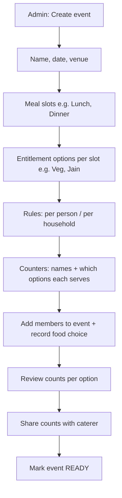
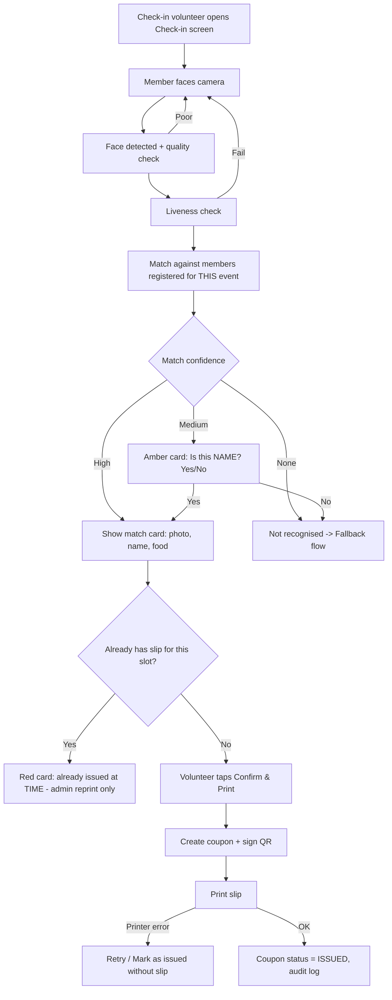
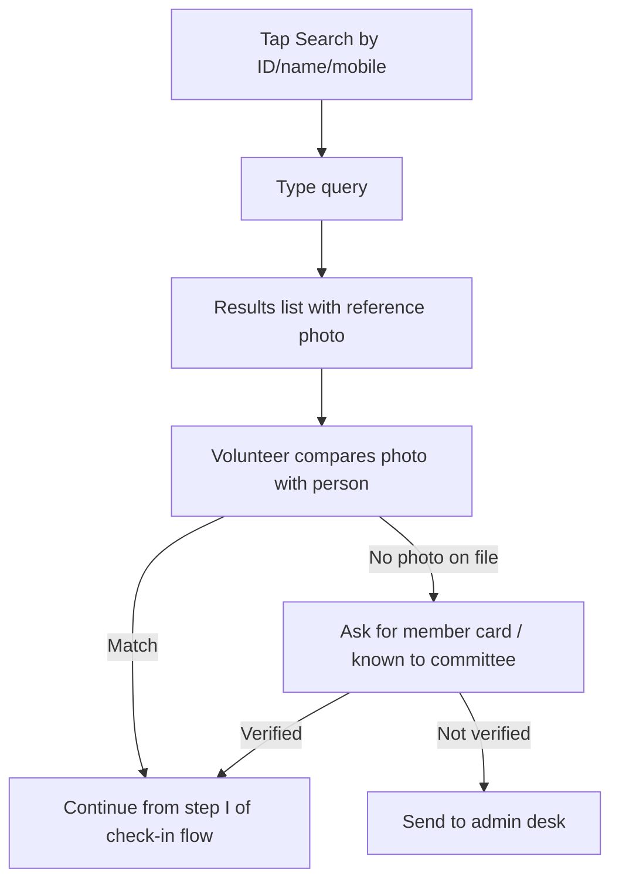
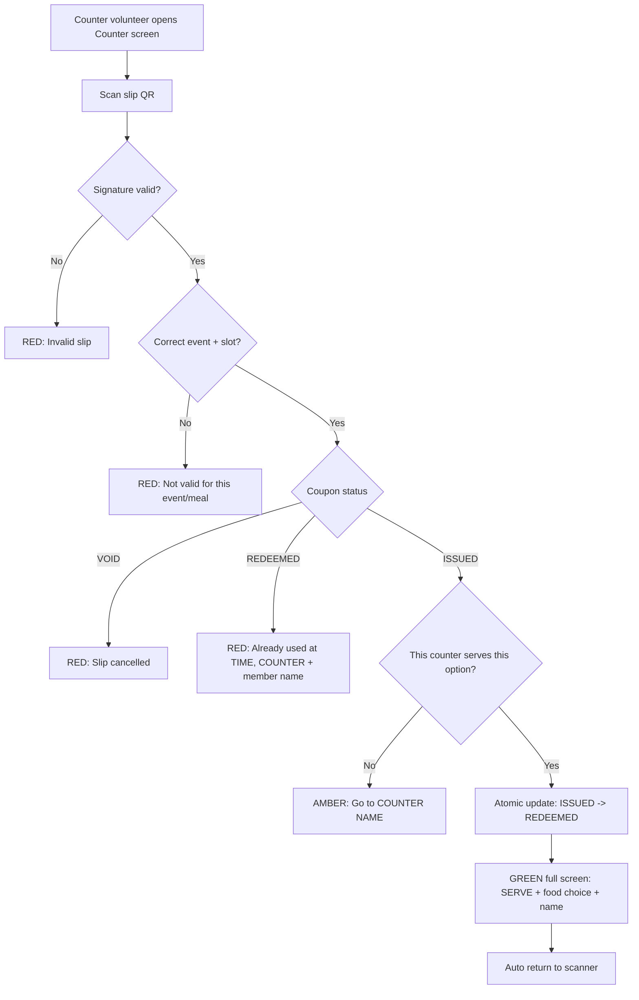
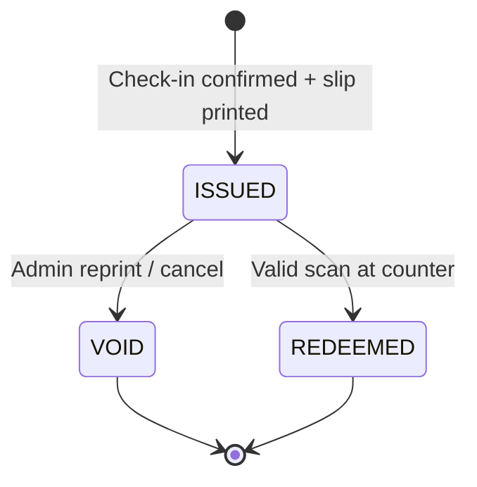
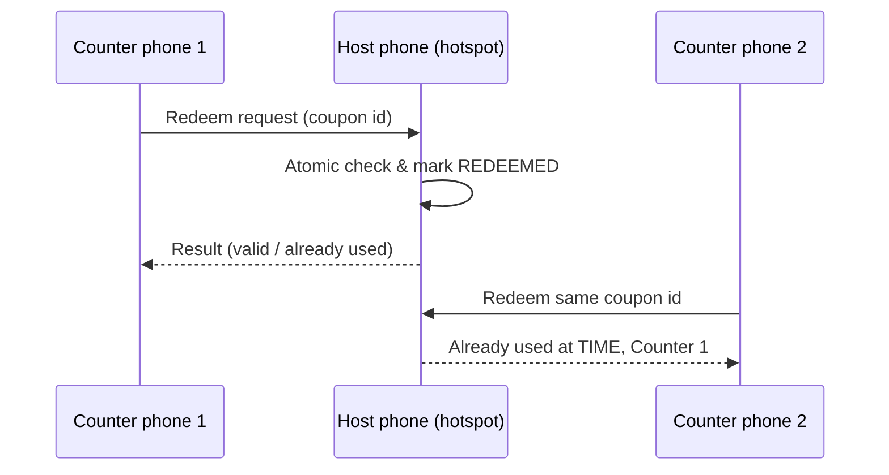
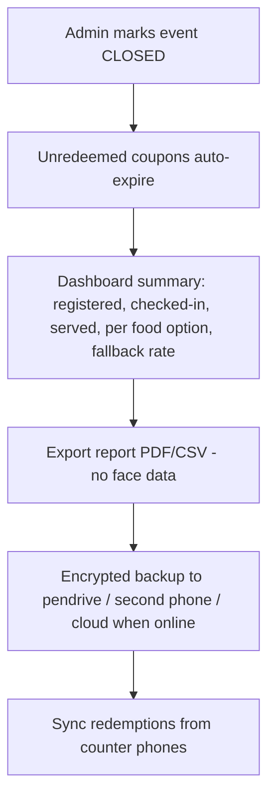

# Process Flow

> Current-build override: read `Demo_Scope.md`, `Decisions_Log.md` and
> `Current_Build.md` first. Their explicit laptop/Python/React changes replace the
> historical phone/Flutter requirements below. All unchanged rules still apply.

> How the product works end to end: from a new customer's setup to event-day check-in, counter redemption and after-event wrap-up.
> Diagrams use Mermaid (renders on GitHub, VS Code with Mermaid preview, Notion, etc.).

---

## 0. Big picture

Members are registered **once** and reused across events. Food choice is collected **per event**.
*(Assumption: confirm with first customer. See `Implementation_Plan.md`.)*

---

## 1. Customer onboarding (done by us)

**Onboarding questionnaire covers:** group size, number of events per year, meals per event, food options, household rules, number of check-in desks and food counters, devices available, languages, whether members have existing ID cards or an Excel list.

---

## 2. Member registration drive

Organizers run a registration desk. Members come in person.

**Target:** under 90 seconds per member.

---

## 3. Event setup

Food choice can be added in bulk (import) or one by one. Changes are allowed until the event is marked **LIVE**; after that only admins can change, and every change is logged.

---

## 4. Event day: check-in (face path)

**Matching scope:** only members registered for this event (smaller list = faster and more accurate). If not found there, the app can offer "Search all members" for walk-ins, which requires admin approval to add them to the event.

---

## 5. Fallback: face not recognised / member without face

Every fallback check-in is tagged `method = fallback` for reporting.

---

## 6. Food counter: redemption

**Atomic update** means the check-and-mark happens in one database transaction. If two counters scan the same slip at the same moment, only one succeeds.

---

## 7. Coupon lifecycle (state machine)

- Reprint = old coupon → `VOID`, new coupon → `ISSUED` (new coupon number).
- `REDEEMED` is final. Only an admin can add a note; it can never go back to `ISSUED`.
- Every transition is audit-logged with device, staff user and time.

---

## 8. Multi-counter sync (Lite setup, offline)

Only needed when there is more than one counter.

- One phone is the **host** (usually the admin/check-in phone). It holds the master coupon table.
- Counter phones send redeem requests over local Wi-Fi hotspot; the host decides.
- **If a counter loses connection:** it switches to *local mode* (verifies signature, keeps its own used list), shows an amber "Offline mode" badge, and syncs its redemptions when reconnected. Conflicts found on sync are flagged in the dashboard.
- Single-counter setups skip sync entirely: the counter verifies signatures and keeps its own used list.

---

## 9. Admin exceptions

| Situation | Action | Who |
|---|---|---|
| Member lost slip | Look up member → Reprint (voids old) | Admin |
| Wrong food chosen | Void coupon → change choice → reissue | Admin |
| Walk-in not registered for event | Add to event + choose food → check-in | Admin |
| Suspected misuse (already-used scans) | Check audit log / coupon history | Admin |
| Printer out of paper / broken | Switch printer or use "redeem by lookup" at counter | Admin |
| Member wants data deleted | Delete member (template, photo, details) | Admin |

---

## 10. After the event

---

## 11. Role permissions summary

| Action | Admin | Check-in | Counter |
|---|:-:|:-:|:-:|
| Register / edit / delete members | ✅ | ❌ | ❌ |
| Create / edit events | ✅ | ❌ | ❌ |
| Face check-in + print slip | ✅ | ✅ | ❌ |
| Fallback search check-in | ✅ | ✅ | ❌ |
| Redeem slips | ✅ | ❌ | ✅ |
| Reprint / void | ✅ | ❌ | ❌ |
| Dashboard | ✅ | counts only | ❌ |
| Backup / settings / staff PINs | ✅ | ❌ | ❌ |
