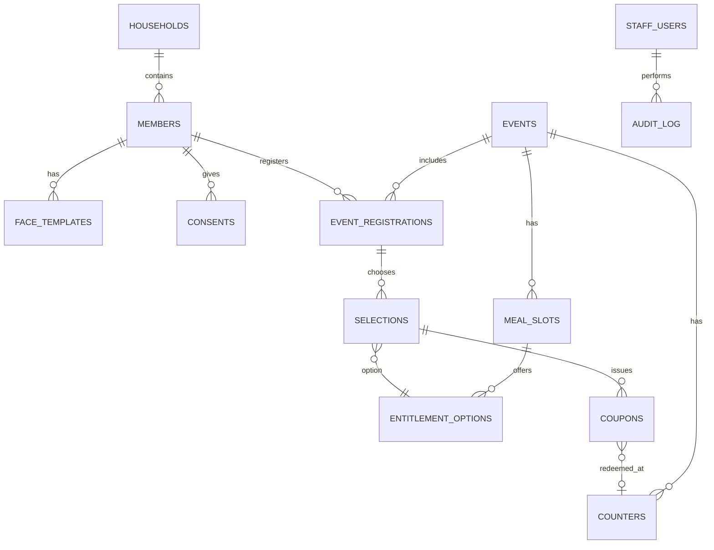

# Technical Requirements

> Current-build override: read `Demo_Scope.md`, `Decisions_Log.md` and
> `Current_Build.md` first. Their explicit laptop/Python/React changes replace the
> historical phone/Flutter requirements below. All unchanged rules still apply.

> Stack, data model, formats and non-functional targets for the MVP (**Lite tier: phone + Bluetooth printer, fully offline**).
> Pro tier (local server kit) is out of MVP scope; the core is designed so it can be added later without rewriting.

---

## 1. Scope of MVP

| In scope | Out of scope (later) |
|---|---|
| Android app (Lite) | iOS app |
| Organizer-run member registration with face | Member self-registration |
| Events, meal slots, food choices | Payments |
| Face check-in + fallback search | Pro local server kit |
| Printed slip with signed QR | Digital coupons on member phones |
| Counter redemption (1 counter, then multi-counter sync) | Zone/gate access control hardware |
| Dashboard, reports, encrypted backup | Cloud dashboard |
| Per-customer config + licence | Self-serve config editor for customers |

## 2. Technology stack

| Layer | Choice | Notes |
|---|---|---|
| App framework | **Flutter (Dart)** | Android first; keeps iOS/desktop possible later |
| State management | Riverpod | |
| Local database | SQLite via **Drift**, encrypted with **SQLCipher** | Typed queries, migrations |
| Secure key storage | `flutter_secure_storage` (Android Keystore) | DB key, signing key |
| Camera | `camera` plugin | |
| Face detection | **Google ML Kit Face Detection** (on-device) | Bounding box, landmarks, eye-open probability, head angles |
| Face embedding | **MobileFaceNet-class TFLite model** via `tflite_flutter` | Must have a licence that allows **commercial use** — verify before adoption (many popular pretrained face weights, e.g. InsightFace's, are non-commercial) |
| QR generation | `qr_flutter` / `qr` | |
| QR scanning | `mobile_scanner` + support for HID barcode scanners (keyboard input) | |
| Signing | Ed25519 via `cryptography` package | |
| Thermal printing | ESC/POS over Bluetooth (e.g. `esc_pos_utils_plus` + `print_bluetooth_thermal`) | Test per printer model |
| Local sync (multi-counter) | Local HTTP server on host phone over hotspot (`shelf`) | Fallback: Android Nearby Connections |
| Localisation | Flutter `intl` + `.arb` files | |
| Reports export | `pdf` + CSV | |
| Testing | `flutter_test`, `mocktail`, integration_test | |

> Any new dependency must be checked for licence (commercial-friendly) and offline behaviour.

## 3. Device requirements

| Device | Minimum | Recommended |
|---|---|---|
| Android phone/tablet | Android 10, 4 GB RAM, 8 MP rear/front camera, Bluetooth 4.2 | Android 12+, 6 GB RAM, good front camera |
| Thermal printer | 58 mm Bluetooth ESC/POS | 80 mm Bluetooth ESC/POS, battery-powered |
| Barcode scanner (optional) | Bluetooth HID 2D scanner | |
| Power | Power bank 10,000 mAh per phone | |

We will certify and recommend **1–2 specific printer models** rather than supporting all printers.

## 4. Face pipeline

```
Camera frame
  -> ML Kit face detection (single largest face)
  -> Quality gate: face size, blur, brightness, frontal angle (yaw/pitch/roll within limits), eyes open
  -> Liveness (active): prompt blink or small head turn, verified via ML Kit eye/head angle values
  -> Align + crop to model input (e.g. 112x112)
  -> TFLite embedding -> L2-normalised vector
  -> Match: cosine similarity vs candidate templates
  -> Decision: HIGH / MEDIUM / NO MATCH (thresholds from calibration)
```

Requirements:
- **Face engine interface** (the only entry point, see `General_Guidelines.md`):
  - `enroll(memberId, frames) -> FaceTemplate`
  - `identify(frame, candidateMemberIds) -> MatchResult {memberId, score, band}`
  - `checkLiveness(frames) -> LivenessResult`
  - `findDuplicates(template) -> List<MatchResult>`
- Enrollment stores **2–3 templates** per member (from different good frames).
- Each template stores `model_version`. Matching only compares templates of the same model version.
- Thresholds (HIGH / MEDIUM) are **not fixed in code**: set from a calibration run in Phase 1, stored in a versioned model config, with a small admin-adjustable range.
- Matching runs in a background isolate so the UI never freezes.

## 5. Data model (core)



Key tables and fields:

| Table | Key fields |
|---|---|
| `members` | id (uuid), member_code, name, mobile, custom_fields (json, from config), household_id, is_minor, reference_thumbnail (encrypted blob), status, created_at |
| `face_templates` | id, member_id, embedding (encrypted blob), model_version, quality_score, created_at |
| `consents` | id, member_id, type (face/biometric), given_by (self/guardian), guardian_name, captured_by, captured_at, withdrawn_at |
| `households` | id, name, head_member_id |
| `events` | id, name, date, venue, status (DRAFT/READY/LIVE/CLOSED) |
| `meal_slots` | id, event_id, name (Lunch/Dinner), start_time, end_time |
| `entitlement_options` | id, meal_slot_id, entitlement_type ("food" by default), label (Veg/Jain…) |
| `event_registrations` | id, event_id, member_id, registered_at |
| `selections` | id, event_registration_id, meal_slot_id, entitlement_option_id |
| `coupons` | id, coupon_code, event_id, member_id, meal_slot_id, entitlement_option_id, status (ISSUED/REDEEMED/VOID), issued_at, issued_by, issued_device, check_in_method (face/fallback), redeemed_at, redeemed_counter_id, redeemed_by, voided_reason |
| `counters` | id, event_id, name, served_option_ids |
| `staff_users` | id, name, role (admin/checkin/counter), pin_hash |
| `audit_log` | id, actor_id, action, entity, entity_id, details (json, no biometric data), device_id, timestamp |

Constraints:
- Unique: one non-void coupon per `(member_id, meal_slot_id)` (or per household if rule configured).
- Redemption: `UPDATE coupons SET status='REDEEMED'… WHERE id=? AND status='ISSUED'` inside a transaction; success only if exactly 1 row changed.

## 6. QR coupon format

Compact, signed payload (kept short so the QR stays small and scans fast):

```
v1.<base64url(payload)>.<base64url(signature)>

payload (CBOR or compact JSON):
{
  "c": "A7K2-93QX",   // coupon code
  "e": "evt_7f3a",    // event id (short)
  "s": "L",           // meal slot
  "o": "JAIN",        // entitlement option code
  "m": "HS-0142",     // member code
  "t": 1790158558     // issued at (unix)
}
signature = Ed25519(private_key, payload_bytes)
```

- Private key: only on devices with `admin`/`checkin` role, in secure storage.
- Public key: on counter devices.
- Keys are generated per customer at onboarding. Key rotation supported per event.

## 7. Configuration file

`customer_config.json`, validated against a JSON schema at load time.

```json
{
  "config_version": 1,
  "customer": { "id": "cust_001", "name": "Green Park Society", "logo": "logo.png", "primary_color": "#1E4FA3" },
  "languages": ["en", "hi", "mr"],
  "member_fields": [
    { "key": "flat_no", "label": "Flat number", "type": "text", "required": true },
    { "key": "wing", "label": "Wing", "type": "select", "options": ["A","B","C"] }
  ],
  "modules": { "food_coupon": true, "attendance": true, "households": true, "data_import": false },
  "entitlement_defaults": { "type": "food", "options": ["Veg", "Jain"] },
  "rules": { "limit_per": "person", "allow_walk_ins": true, "fallback_requires_photo_check": true },
  "face": { "enabled": true, "threshold_adjust": 0 },
  "slip": { "width_mm": 58, "footer_text": "Valid once · This event only" },
  "counter": { "result_display_seconds": 2, "sounds": true }
}
```

## 8. Non-functional requirements

| Area | Requirement |
|---|---|
| Offline | 100% of features work with no internet |
| Face identify time | ≤ 1.5 s from good frame to match card, for up to 2,000 event members, on minimum spec device |
| Check-in throughput | ≥ 4 members/minute per desk (face path, including print) |
| Print time | ≤ 3 s per slip |
| Counter scan → result | ≤ 1 s |
| Registration | ≤ 90 s per member including face capture |
| Accuracy targets (to validate in Phase 1) | High-band false match rate ≈ 0 in test set; fallback rate < 10% at events |
| Capacity | 5,000 members per customer on one device |
| Battery | Check-in phone lasts 4 hours of continuous use with a power bank |
| Reliability | No data loss on app crash or phone restart mid-event (write-ahead logging) |
| Security | Encrypted DB, signed coupons, role-based access, audit log |
| Privacy | No raw face gallery, no data leaves device except encrypted backups/exports chosen by admin |
| Localisation | UI fully translatable; Devanagari rendering supported on screen and slip |
| Accessibility | Touch targets ≥ 56 dp, contrast ≥ 4.5:1 |

## 9. Backup & restore

- Manual and end-of-event prompted backup: encrypted archive (DB + thumbnails + config) with customer passphrase.
- Destinations: USB OTG pendrive, second phone (local transfer), cloud drive when internet is available.
- Restore flow tested every release.

## 10. Licensing (our product licence)

- Licence file signed by us: customer id, device limit, expiry date, enabled tier/modules.
- Verified offline with our public key built into the app.
- Expired → read-only mode (view, export, backup allowed; no new check-ins).

## 11. Logging & diagnostics

- Local rotating logs, no personal or biometric data.
- "Export diagnostics" button for support (logs + app/model/config versions only).

## 12. Future (Pro tier) compatibility

- Keep the core as plain Dart packages (no Flutter UI dependency) so a local server version can reuse them.
- Same face model and templates must work on server and phone.
- Sync protocol (section 8 of `Process_Flow.md`) designed so a server can replace the host phone.

## Current implementation dependency register
The Python/React replacement packages, licences and offline constraints are listed in
`DEPENDENCIES.md`. The implementation currently targets Python 3.12 (within the approved
3.11+ stack); dependency locks are checked in.
